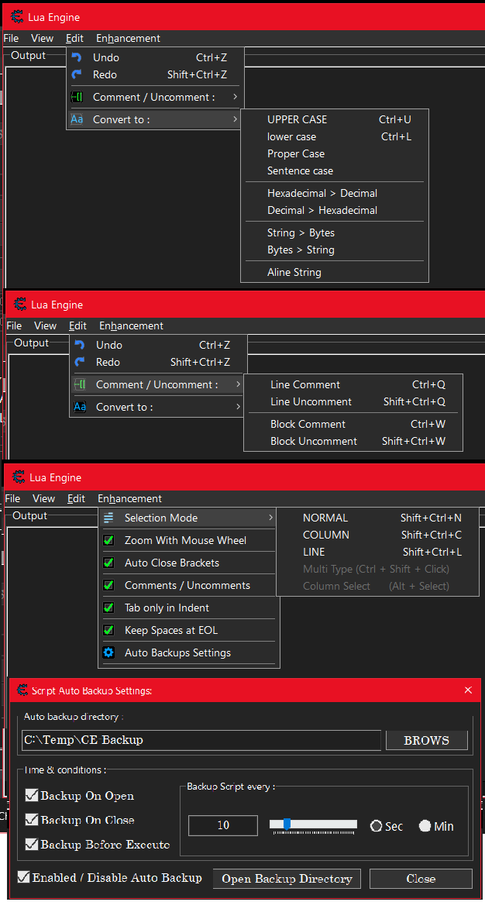

# CE-Lua-Editors-Enhancement

	Author:  YoucefHam
	Email:   youcefham20@gmail.com
	Discord: YoucefHam
	GitHub:  https://github.com/YoucefHam

# Lua Editors Enhancement:

## Features :

- Add button "LUA ENGINE" to ce main form.(next to memory view button).
- Add shortcut "CTRL+L" to open lua engine from ce main form.
- Add checkbox "CLEAR" to lua engine, to clear output before execute.(on top of execute button)
- Add popup item "CLEAR OUTPUT" to lua engine, to clear output.
- Add inside "LUA ENGINE" and "LUA EDITOR" and "AUTOASSEMBLE EDITOR":
- Use "CTRL + MOUSE WHEEL" to zoom font size and save it to restore later.
- Use "AUTO CLOSE BRACKETS" with selected code "str" 'txt' (code) [] {}. See "AutoClose.List"
- Use "CTRL + Q" to comment code in line.  --code
- Use "CTRL + W" to comment code in block. --[=[code]=]
- Use "CTRL + SHIFT + Q" to uncomment (selected) code in line --code.
- Use "CTRL + SHIFT + W" to uncomment (selected) code in block --[=[code]=].
- Use "TAB ONLY IN INDENT" for tab only in indents. (space at the start of the line)
- Use "KEEP SPACES AT EOL" to stop editor from removing spaces in the end of the line.
- Add popup item "BROWSE THIS MEMORY REGION" to editor popup. (for selected text)
- Add popup item "DISASSEMBLE THIS MEMORY REGION" to editor popup. (for selected text)
- Add allow to drag and drop selected text.
- Use "AUTO BACKUP SCRIPT" to save editor code to file:
	- "OnOPEN" : backup after editor opened.
	- "OnCLOSE" : backup before editor closed.
	- "OnEXECUTE" : backup before editor execute code.
	- "OnTIME" : backup opened editors code every x amount of time.
- Add menu item "SELECTION MODE": (some of them works without this extension)
	- "HOLD ALT + SELECT" : select text in column mode.
	- "HOLD CTRL + SHIFT + CLICK" : type in multiple places.
	- "CTRL + SHIFT + N" : toggle normal selection mode.
	- "CTRL + SHIFT + C" : toggle column selection mode.
	- "CTRL + SHIFT + L" : toggle line selection mode.
- Add menu "EDIT":
	- Undo
	- Redo
	- Comments / Uncomments:
		- Comment in Line
		- Uncomment in Line
		- Comment in Block
		- Uncomment in Block
	- Convert To:
		- UPPER CASE
		- lower case
		- Proper Case
		- Sentence case
		- Hexadecimal > Decimal
		- Decimal > Hexadecimal
		- String > Bytes
		- Bytes > String
		- Aline String

## Screenshot :

## Installation :

- Put the file "Lua Editors Enhancement.lua" in CE Autorun folder.